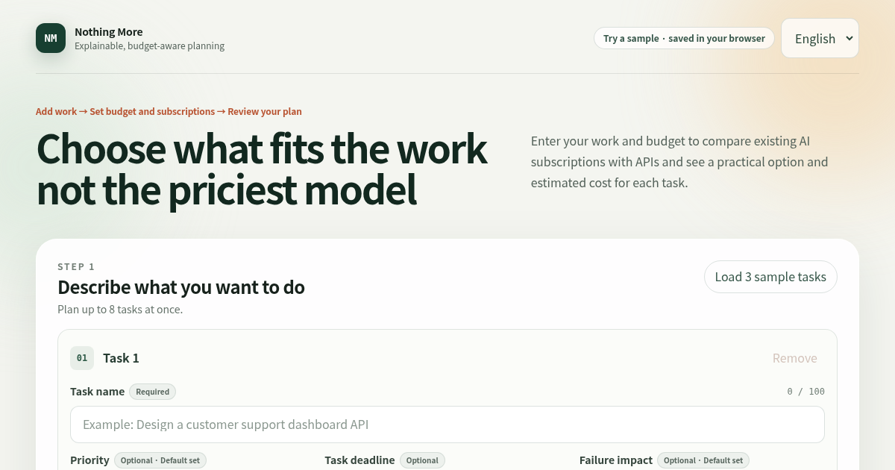

# Nothing More

**Use what works. Skip the rest.**

Nothing More helps an individual turn up to eight AI-assisted tasks into an
explainable access and incremental-cash plan. GPT-5.6 structures the workload once; versioned
TypeScript rules—not the model—check limits, calculate estimates, and choose the displayed route.

[Open the public demo](https://frontier-workload-planner.vercel.app) ·
[Watch the 2:40 demo](https://youtu.be/iI3lDYjBCUc) ·
[Review the release gates](./SUBMISSION_CHECKLIST.md)

## Try it in 60 seconds

No sign-in or API key is needed for the sample path.

1. Open the public demo. A fresh browser starts in **English**; if this site already has another
   saved locale, choose **English**.
2. Select **Load 3 sample tasks**.
3. In Step 2, select **Plan with this amount** to confirm what the sample budget includes.
4. Keep **Try a sample** selected, then select **Create a sample plan**.
5. Review the usage method and estimated cost shown for each task.

The sample analysis is created entirely in the browser from a checked-in deterministic fixture. It
does not send task text to the site server or an external AI. Input can still be saved as plaintext
in browser LocalStorage, so use the supplied sample tasks rather than sensitive content. The linked
public demo has been checked against the current personal-user flow; unauthenticated Live analysis
remains disabled there.



The repository slug, public URL, preview-image filename, and existing browser storage keys retain
`frontier-workload-planner` for link and restore compatibility. The user-facing product name is
**Nothing More**.

## Submission story and evidence

- [Human-written Korean retrospective](./docs/submission/HUMAN_RETROSPECTIVE_KO.md) — the maker's
  official personal account; Codex assisted with proofreading, technical fact-checking, and English
  translation.
- [English translation](./docs/submission/HUMAN_RETROSPECTIVE_EN.md) — Codex-drafted,
  maker-reviewed translation of the human-written Korean account.
- [Unedited Korean draft](./docs/submission/HUMAN_RETROSPECTIVE_KO_ORIGINAL.md) — preserved authorship
  record; its preliminary technical wording is superseded by the reviewed documents.
- [AI collaboration record](./docs/submission/AI_COLLABORATION_STORY.md) — code-grounded,
  AI-authored and human-reviewed summary.
- [Editable 16:9 comparison deck](./docs/submission/AI_COLLABORATION_DECK.html) and
  [8-page PDF](./docs/submission/AI_COLLABORATION_DECK.pdf) — human-reviewed before/after screenshots
  and the prompt-to-change story.
- [Privacy and data-flow evidence](./docs/submission/PRIVACY_DATA_FLOW.md) — implemented boundaries,
  tests, and claims the project deliberately does not make.

## Submission status

The current public application release is
`185ae7a588d3448675a0e16de4f9953b991397f1`. At deployment time the clean local checkout,
GitHub `main`, and verified Vercel metadata matched that SHA. A fresh `ko-KR` browser context still
opened in English, completed the three-task sample plan, and kept Korean and Japanese available as
language choices. A fresh public Live request remained fail-closed with the documented sanitized
`403 LIVE_ANALYSIS_DISABLED` response and `Cache-Control: no-store`.

The protected Live and video evidence were captured from
`97c30de29a520e15b6439bb514179418736b9180`. From that exact evidence release, one locally enabled
Live request returned HTTP `200`, `mode: live`, model `gpt-5.6-sol`, the `best-fit-analysis-v2`
contract, and the requested task identity. The current public release changes only the fresh-browser
default from Korean to English, together with its tests and documentation; it does not change the
planner, API route, storage schema, or privacy boundary.

The [final public video](https://youtu.be/iI3lDYjBCUc) is 2:40.37 with English narration and
published English captions. Later commits may update submission documentation only; they do not
change the public application release above. Eligibility, terms, and other personal confirmations
remain human-owned gates in `SUBMISSION_CHECKLIST.md`. See the
[locally enabled Live record](./docs/submission/LIVE_VALIDATION.md) and
[production QA report](./docs/submission/PRODUCTION_QA_REPORT_KO.md).

## The problem

People often combine an AI subscription with occasional API use, but comparing those access paths
is difficult. Subscription quota, money already committed, new cash, API usage, and hypothetical
savings are easy to mix into one misleading number. A language model can classify work, but asking
it to invent prices or select a vendor makes the result difficult to reproduce.

## What the app does

- Accepts one to eight tasks with priority, an optional task deadline, and failure impact.
- Accepts a total incremental-cash budget and one of three transparent planning strategies.
- Lets the user skip subscriptions or add up to eight personal or organization-provided accounts
  without knowing exact credits or reset details.
- Records multiple remaining-limit percentages shown by an official service in one account card;
  the lowest percentage is a reference warning, not an invented exact task count.
- Separates ChatGPT/Codex, Claude, Gemini Apps chat, Google Antigravity, organization Gemini Code Assist,
  GitHub Copilot, and custom subscriptions instead of treating a vendor name as one entitlement.
- Offers a free deterministic sample path and an explicit GPT-5.6 analysis path.
- Produces Low / Expected / High estimates and separates API cash, subscription use, new commitment,
  and paid overage.
- Reuses a completed workload analysis for local recalculation when a changed budget is reconfirmed,
  or when the strategy, task priority, task deadline, failure impact, resource observations, or
  bounded price overrides change. Changing task names, descriptions, or task-list membership
  requires a new sample or Live analysis.
- Saves and restores one recent source-only scenario and exports allowlisted JSON plus localized
  Markdown.
- Provides Korean, English, and Japanese interfaces, including responsive mobile layouts.

The result is a planning estimate. It is not a quote, mathematical optimum, benchmark, or objective
model ranking.

Third-party product names are plain-text identifiers for public catalog entries and source links.
No third-party logo is bundled, and no affiliation, sponsorship, or endorsement is claimed.

## How a plan is built

1. The user supplies tasks, budget meaning, and optional observations about AI resources. Separate
   accounts may be added separately; concurrent limits on one account stay together as unknown
   quota rather than being double-counted as independent capacity.
2. In Live mode, one analysis operation makes a server-side GPT-5.6 Structured Output request and
   may make one automatic retry. In sample mode, a checked-in deterministic fixture returns the
   same contract shape entirely in the browser.
3. The planner validates the versioned contract and maps size bands to fixed token ranges.
4. Versioned catalog and access-policy evidence is resolved at an explicit calculation time.
5. Integer micro-USD arithmetic calculates Low / Expected / High standard-text estimates.
6. Deterministic ordering applies quality floors, budget relief, quota reservation, fallback, held,
   and infeasible states.
7. Planning-only changes reuse the saved workload analysis: a reconfirmed budget, strategy, task
   priority, task deadline, failure impact, resource observation, or bounded price override
   recalculates without another model request. Editing task names, descriptions, or task-list
   membership requires a new sample or Live analysis.

### GPT-5.6's role

GPT-5.6 returns only bounded workload fields such as complexity, reasoning depth, size band,
iteration range, work mode, minimum quality, required capabilities, upgrade conditions, and failure
risk. It does **not** choose a provider, price, subscription, token total, budget action, or final
route. Those decisions remain in reviewable program rules.

The server uses the Responses API with Zod Structured Outputs, low reasoning, a bounded output
budget, and at most one automatic retry. The OpenAI API key is server-only.

## Human-owned design decisions

The product owner made and reviewed the final scope and UX decisions, including these two central
boundaries:

### Store raw sources, not old answers

LocalStorage keeps the task input, the versioned GPT analysis snapshot, raw resource observations,
the personal/organization provisioner choice, and exact user override sources. It does not treat
previously resolved routes, ledgers, savings, or
catalog evidence as restore authority. Restore validates the source, resolves it against the current
versioned rules, and recalculates the plan.

In this design, "source" includes the versioned workload analysis that becomes input to the
deterministic planner; it does not mean only the user's original prose.

This is why the app can preserve user intent without silently trusting a stale result.

### Let GPT classify work, not decide money

GPT-5.6 is useful for turning natural-language work into a closed schema. Prices, provider
eligibility, limits, quota accounting, priorities, and final route selection need deterministic and
testable rules. Keeping this boundary also prevents a prompt change from silently changing the
financial meaning of an existing plan.

Unverified subscription observations remain conditional. Missing personal account access, billing,
or regional eligibility is never presented as confirmed merely because a catalog entry exists.

## How Codex contributed

This project was built through an extended, review-driven Codex collaboration rather than a single
code-generation pass.

- **Requirements and structured contract:** Codex helped convert written product constraints into
  versioned request, response, storage, and export schemas while keeping provider and pricing
  decisions out of GPT output.
- **Deterministic planning engine:** Codex helped implement fixed-decimal cost arithmetic, stable
  route ordering, quality floors, budget relief, quota reservation, and strict source-versus-authority
  boundaries.
- **Restore-clock P1:** Review found that restoring a scenario could move the calculation and pricing
  date backward. Codex helped reproduce the sequence, centralize maximum-time merging, use a reducer
  safe under React batching, and add regression coverage for delayed analysis and restore paths.
- **Personal-user UX iteration:** The product owner reviewed the app as an individual user and marked
  confusing spacing, jargon, hidden controls, incomplete-input failures, and mobile issues with
  screenshots. Codex iterated on the flow, plain-language recovery dialogs, optional advanced
  settings, responsive layout, and localized copy while preserving the strict planning rules.
- **Testing and review:** Codex helped turn each review finding into focused regression tests, then
  repeatedly ran unit tests, ESLint, TypeScript, production builds, and diff checks before a
  checkpoint was accepted.

Codex proposed and implemented alternatives; the human owner chose the product name, target user,
scope, evidence policy, UX direction, and final acceptance criteria.

## Run locally

Requirements: Node.js 22.x.

```bash
npm ci
npm run dev
```

Open <http://localhost:3000>, confirm **English** is selected, load the three sample tasks, keep
**Try a sample** selected, and create a sample plan. This path requires no API key and makes no Live
analysis call.

### Locally enabled GPT-5.6 check

Only use a private local environment for the Live check:

```bash
cp .env.example .env.local
```

```dotenv
OPENAI_API_KEY=your_server_only_key
OPENAI_ANALYSIS_MODEL=gpt-5.6
ENABLE_LIVE_ANALYSIS=true
```

Restart the server, select **Analyze my tasks**, enter non-sensitive sample work, and submit once.
Never add `NEXT_PUBLIC_` to the key name, paste a key into the UI, record it, or commit `.env.local`.
Public deployment should keep Live analysis disabled until authentication and usage controls exist;
the sample path remains available.

## Privacy and persistence

- The public sample path runs entirely in the browser and does not send task text to the site server
  or an external AI.
- One recent successful scenario is automatically stored in browser LocalStorage as plaintext.
- Stored data can include task names, task descriptions, settings, resource observations, and user
  catalog override sources.
- The UI discloses this before submission and provides a delete action.
- When a private operator explicitly enables Live analysis, the app server forwards task IDs,
  names, and descriptions to OpenAI with Responses API `store: false`; this app has no database or
  request-body logging path. OpenAI does not use API inputs for training by default. Separate
  abuse-monitoring logs normally retain customer content for up to 30 days and may be kept longer
  when legally required or reasonably necessary to prevent harm. See
  [OpenAI API data controls](https://developers.openai.com/api/docs/guides/your-data).
- API keys, other secret server configuration, hidden prompts, raw provider errors, and connector
  receipts are not stored in the browser.
- Markdown and JSON exports include task content. Inspect them before copying or sharing.

Do not enter confidential work into the public sample deployment.

## Verification

```bash
npm test
npm run lint
npm run typecheck
npm run build
git diff --check
```

The sample UI, disabled-Live response, locally enabled Live call, mobile viewport, and captured
application release were also checked manually. Devpost-specific human gates remain in
`SUBMISSION_CHECKLIST.md`.

## Project documents

- [SPEC.md](./SPEC.md): product, calculation, evidence, persistence, and export contracts
- [DECISIONS.md](./DECISIONS.md): reviewed engineering decisions
- [TASKS.md](./TASKS.md): implementation checkpoints and remaining follow-ups
- [DEVPOST.md](./DEVPOST.md): final English submission copy
- [VIDEO_SCRIPT.md](./VIDEO_SCRIPT.md): historical recording plan for the
  [final 2:40 demo](https://youtu.be/iI3lDYjBCUc)
- [SUBMISSION_CHECKLIST.md](./SUBMISSION_CHECKLIST.md): human-only release and eligibility gates

## License

[MIT](./LICENSE)
